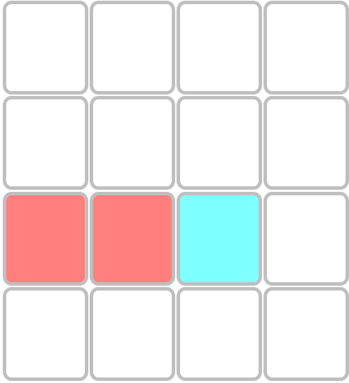
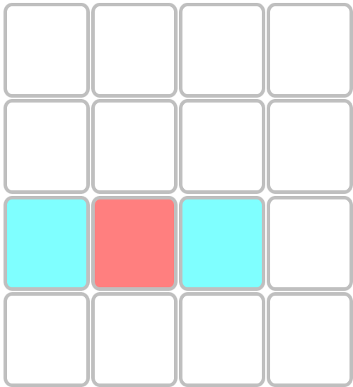
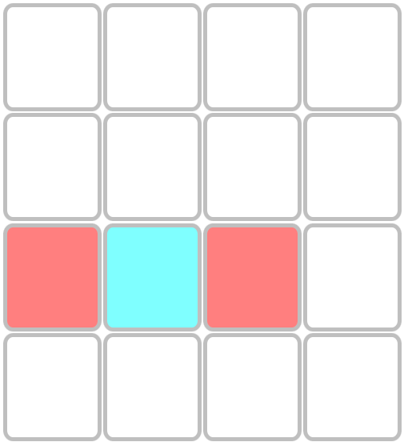
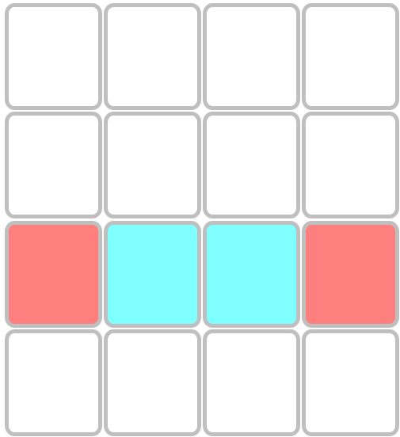
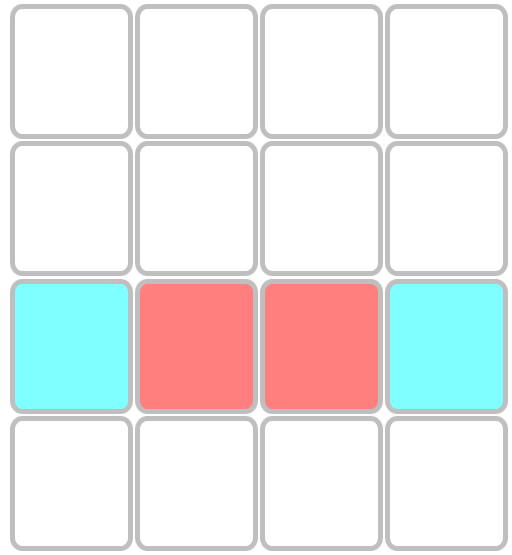
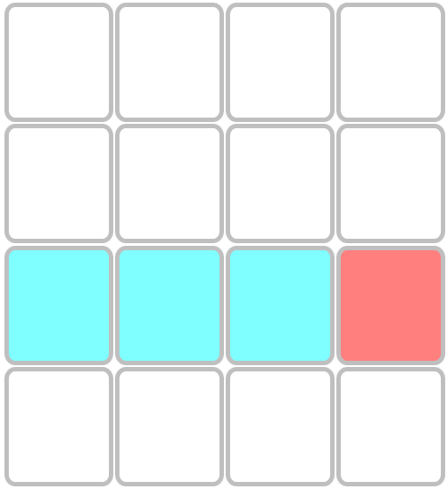

## 一个简单的双人对弈游戏

### 体验主页 
[点我跳转](https://hrwangcn.gitee.io/dkone/dkone.html)

### 游戏规则
+ 双人对弈，棋盘规格为4×4格局，先占满一行或者一列者赢
+ 执红子先手，蓝子后手，单次仅可下一颗棋子，落子只可能导致其所在的行或者列产生消子
+ 当棋盘下满时，棋子个数多的一方赢，若两方棋子个数相等则为和棋。

### 消子规则 
+ 二顶一：同一直线上有且仅有1枚敌子、2枚执手方子，敌子与任意执手方子相邻，但不同时相邻，图中任意一颗红子为落子，蓝子右侧为空位，则构成吃子，蓝子消子。
+ 一撑乎：执手方子与2枚敌子相邻，且同一直线上再无棋子，如下图，红子为落子，则蓝子被吃子
+ 一夹沟：敌子与2枚执手方子相邻，且同一直线上再无其它棋子，如下图，红子为落子，则蓝子被吃子
+ 两夹沟：执手子与己方棋子在同一直线上间隔2枚敌子，如下图，红子为落子，则蓝子被吃子
+ 两撑乎：执手子与己方1子相邻，且位于2枚敌子中间，如下图，红子为落子，则蓝子被吃子
+ 一串三：在执手子所在的行或者列上存在连续3个敌子，如下图，红子为落子，则蓝子被吃子
+ 行和列可以同时消子。

